# Expense Tracker

A web app for tracking personal expenses. Each expense has a title, amount, category, and date, and is stored in PostgreSQL. The backend is a REST API (Node.js, Express, PostgreSQL), and the frontend is a single page (HTML, Bootstrap, and vanilla JavaScript) that talks to the API with `fetch`.

## How to run

**Prerequisites:** Node.js (LTS), PostgreSQL (or Docker), and VS Code.

**Backend**

1. **Create the `.env` file.** Copy `.env.example` (in the **project root**, next to `docker-compose.yml`) to a new file named `.env` in the same folder, and write your PostgreSQL password in it:
   ```bash
   cp .env.example .env
   ```
2. **Create the database and run `schema.sql`.** Pick one option:
   - **Option A: Docker** (what I used). Keep `DB_USER=postgres` in `.env`. From the project root:
    ```bash
    docker compose up -d
    ```
     Wait about 10 seconds the first time, because PostgreSQL needs a moment to create the database. Then load the schema:
    ```bash
    docker compose exec -T postgres psql -U postgres -d expense_tracker < backend/schema.sql
    ```
    If you get "the database system is starting up" or "database does not exist", wait a few seconds and run it again (it is safe to repeat). A NOTICE that the table does not exist is normal on the first run.

   - **Option B: local PostgreSQL.** Create an empty database named `expense_tracker` (in pgAdmin or `psql`), then run the schema (it asks for your password):
    ```bash
    psql -h localhost -U postgres -d expense_tracker -f backend/schema.sql
    ```
    Or open `backend/schema.sql` in pgAdmin's Query Tool and run it. Make sure the values in `.env` match your local PostgreSQL setup.

   `schema.sql` drops and recreates the `expenses` table, so running it again resets the data to the sample rows.
   
3. **Install the packages and start the server:**
   ```bash
   cd backend
   npm install
   npm start
   ```
   You should see `Server running on http://localhost:3000`.
4. **Try it:** open `http://localhost:3000/api/expenses` in the browser, or use Thunder Client (or any API testing application).

**Frontend**

1. Make sure PostgreSQL and the backend are running (see the Backend steps above). The page expects the API at `http://localhost:3000`.
2. Install the **Live Server** extension in VS Code.
3. Right-click `frontend/index.html` and choose **Open with Live Server**. The page opens in the browser (usually at `http://127.0.0.1:5500`).

Any static file server works too, for example `python3 -m http.server 5500` from inside the `frontend/` folder. If the backend is not running, the page shows an alert instead of the table.


## Development environment note

I use an immutable Linux distribution built from Fedora called Bazzite. Since Bazzite's base filesystem is immutable, I ran PostgreSQL as a Docker container instead of installing it directly on the host; this is also the standard approach recommended for atomic distros. Similarly, Node.js and the project code run inside a Distrobox container (a lightweight container that behaves like a normal Linux environment for development purposes).

The `.env` file and the `node_modules` folder are not included in this submission: the first for security, the second because `npm install` recreates it.

## API

Base URL: `http://localhost:3000/api/expenses`

| Method | Path | Description | Success | Errors |
|--------|------|-------------|---------|--------|
| GET | `/api/expenses` | Return all expenses | 200 | none |
| GET | `/api/expenses/:id` | Return one expense | 200 | 404 |
| POST | `/api/expenses` | Add an expense | 201 | 400 |
| PUT | `/api/expenses/:id` | Update an expense | 200 | 400, 404 |
| DELETE | `/api/expenses/:id` | Delete an expense | 200 | 404 |

**Expense shape**

```json
{
  "id": 1,
  "title": "Lunch",
  "amount": 4.5,
  "category": "Food",
  "date": "2026-01-15"
}
```

The `id` is created by the database and is never sent by the client.

**Validation** (POST and PUT return `400` with a JSON `message` explaining the problem):

- `title` is required and cannot be empty or only spaces.
- `amount` must be a number of at least 0.01.
- `category` must be one of `Food`, `Transport`, `Bills`, `Entertainment`, `Other`.
- `date` must be a valid date in `YYYY-MM-DD` format.

An `id` that does not exist, or is not a valid number, returns `404`.

## Features

**Backend (Phase 1)**

- [x] Five endpoints: list, get one, add, update, delete
- [x] Data is saved in a PostgreSQL database (it survives a server restart)
- [x] Every query uses parameters (`$1`, `$2`), never string concatenation
- [x] Validation with clear `400` messages, and `404` for missing or invalid ids
- [x] CORS enabled for the frontend
- [x] `amount` returned as a number and `date` as `YYYY-MM-DD`

**Frontend (Phase 2 & 3)**

- [x] Add an expense (with validation)
- [x] Delete an expense
- [x] Edit an expense (in a modal)
- [x] Filter by category
- [x] Summary cards (total, count, highest), laid out with CSS Grid
- [x] Loading spinner and clear error alerts (including when the server is off)
- [x] Responsive layout (phone and desktop)
- [x] **Bonus**: search by title, sort by clicking a column title, and export the visible expenses as CSV

## API test screenshots

All tests were run with Bruno (A postman alternative), one screenshot per case.

### GET

<p align="center">
  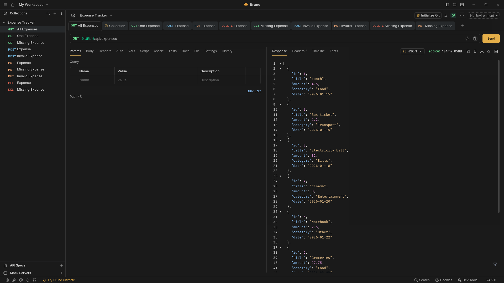<br>
  <em>GET all: 200</em>
</p>

<p align="center">
  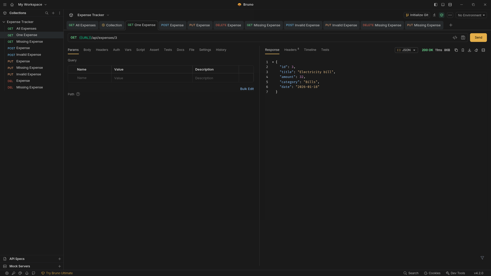<br>
  <em>GET one: 200</em>
</p>

<p align="center">
  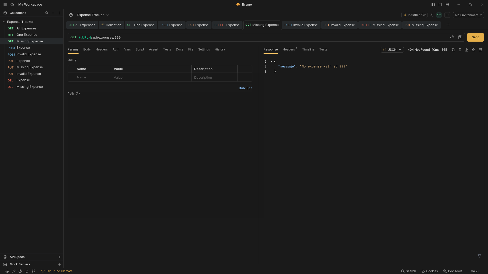<br>
  <em>GET missing id: 404</em>
</p>

### POST

<p align="center">
  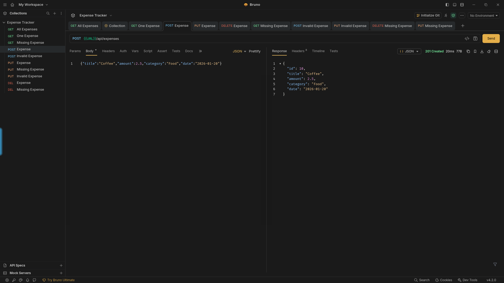<br>
  <em>POST valid: 201</em>
</p>

<p align="center">
  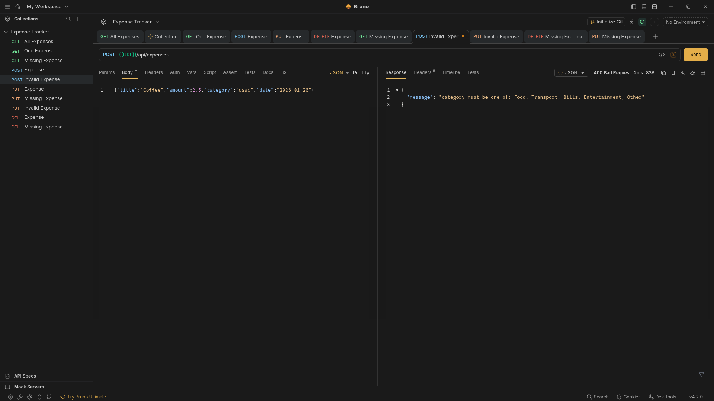<br>
  <em>POST invalid category: 400</em>
</p>

<p align="center">
  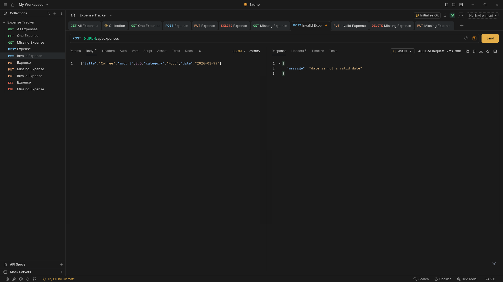<br>
  <em>POST invalid date: 400</em>
</p>

<p align="center">
  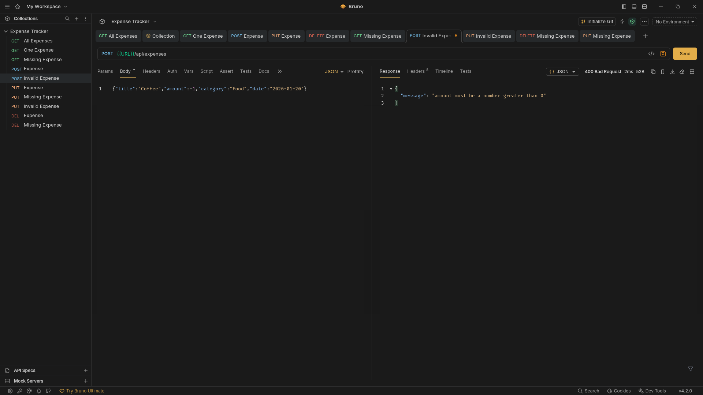<br>
  <em>POST negative amount: 400</em>
</p>

<p align="center">
  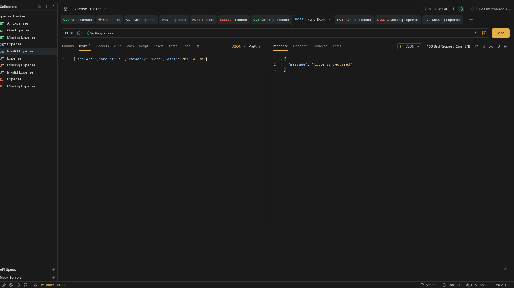<br>
  <em>POST empty title: 400</em>
</p>

### PUT

<p align="center">
  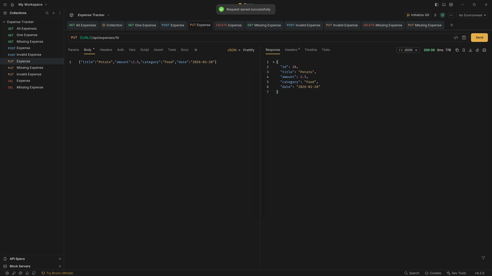<br>
  <em>PUT valid: 200</em>
</p>

<p align="center">
  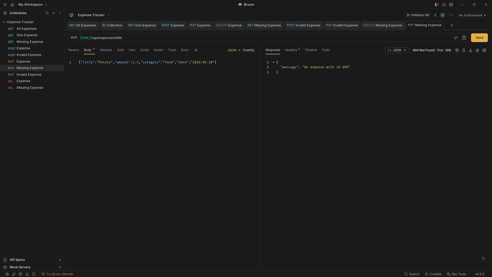<br>
  <em>PUT missing id: 404</em>
</p>

<p align="center">
  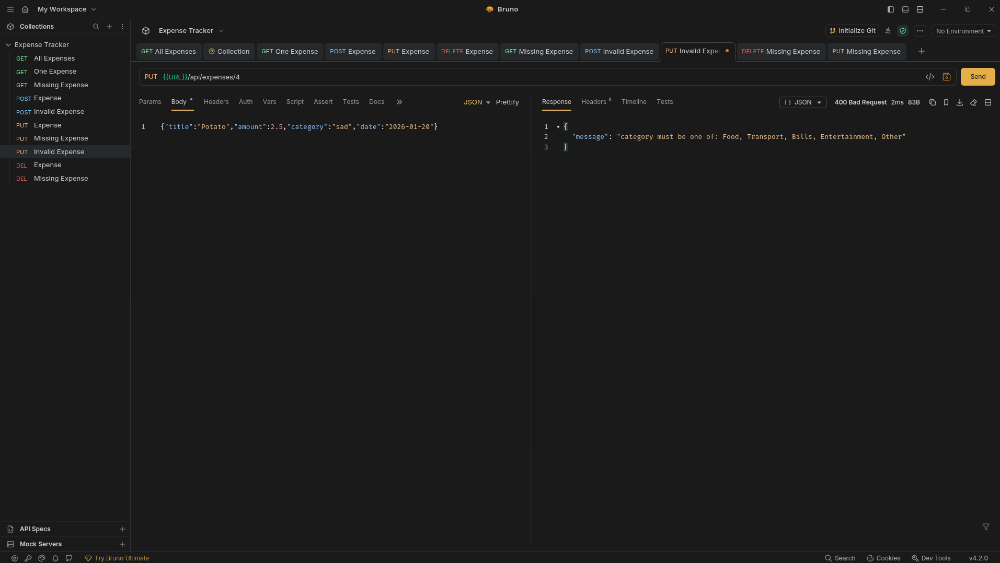<br>
  <em>PUT invalid data: 400</em>
</p>

### DELETE

<p align="center">
  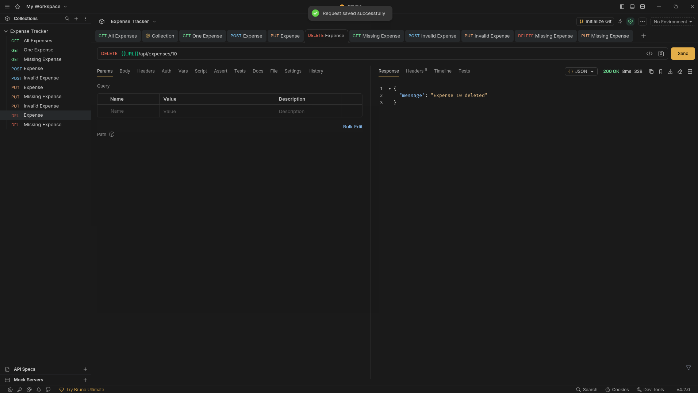<br>
  <em>DELETE valid: 200</em>
</p>

<p align="center">
  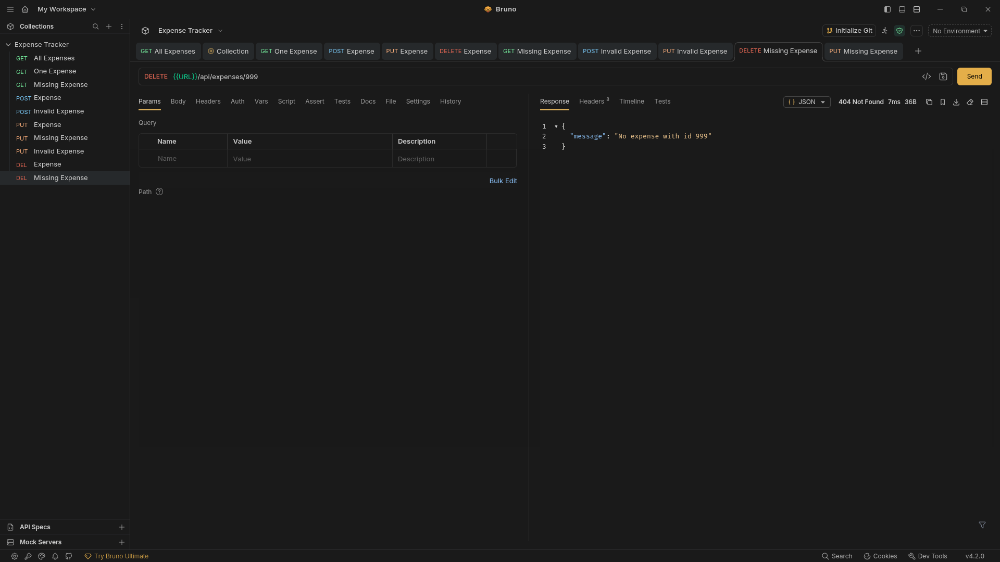<br>
  <em>DELETE missing id: 404</em>
</p>

## App screenshots

<p align="center">
  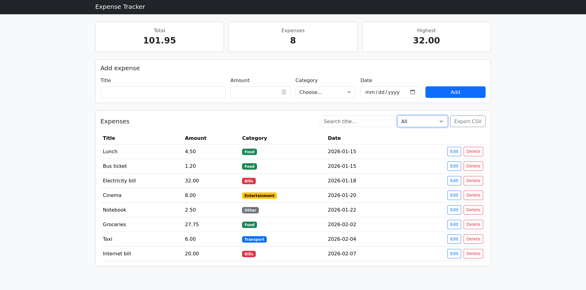<br>
  <em>Desktop</em>
</p>

<p align="center">
  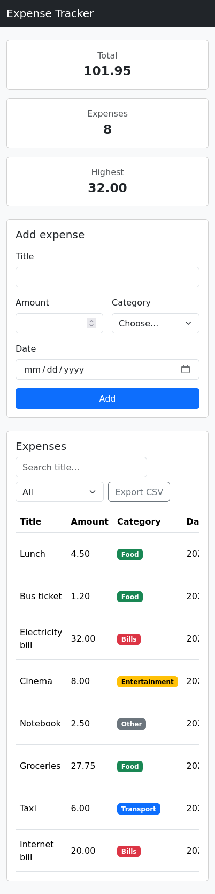<br>
  <em>Mobile (375px wide)</em>
</p>

## What was the hardest part ?

Honestly, the hardest part was the frontend JavaScript. Building the whole interface by hand, with no framework, meant doing all the wiring, checking and validating myself, building table rows with the DOM, validating two forms, and keeping the page in sync with the server. It got overwhelming as `app.js` grew.

Two things helped. First, I stopped patching the page by hand: after every add, edit or delete I call `refresh()`, which asks the server for the list again and redraws everything, so there is one source of truth. Second, I moved the repeated work into small helpers (like `request()` for every API call, and `validateForm()`, `readForm()` and `toPayload()` shared by the add form and the edit modal) and grouped the file into labelled sections. After that, each new feature was mostly wiring existing pieces together, and I tested each chunk in the browser before starting the next.

## Demo Video

A recorded walkthrough of the app (adding, editing, deleting, filtering, searching, sorting, and exporting to CSV) is available here: [link](https://drive.google.com/file/d/1wy97Kn0RccdteIgBLxGNvh0jjeXrBwAB/view?usp=sharing)